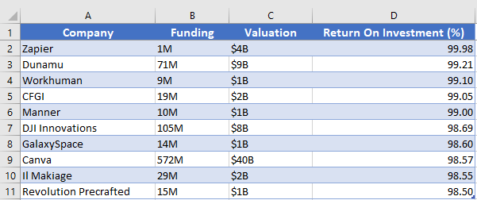
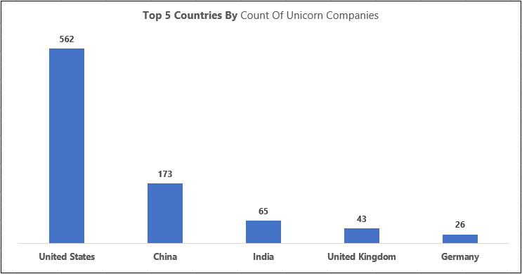
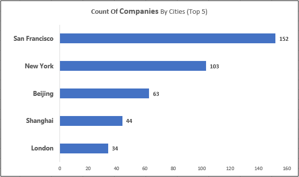
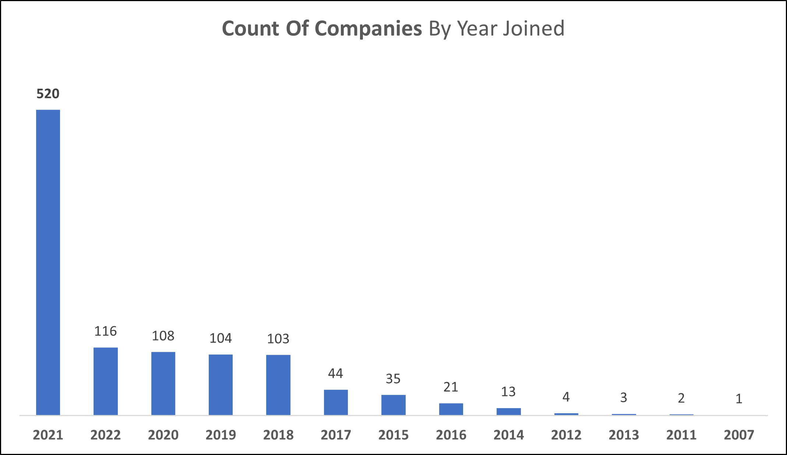
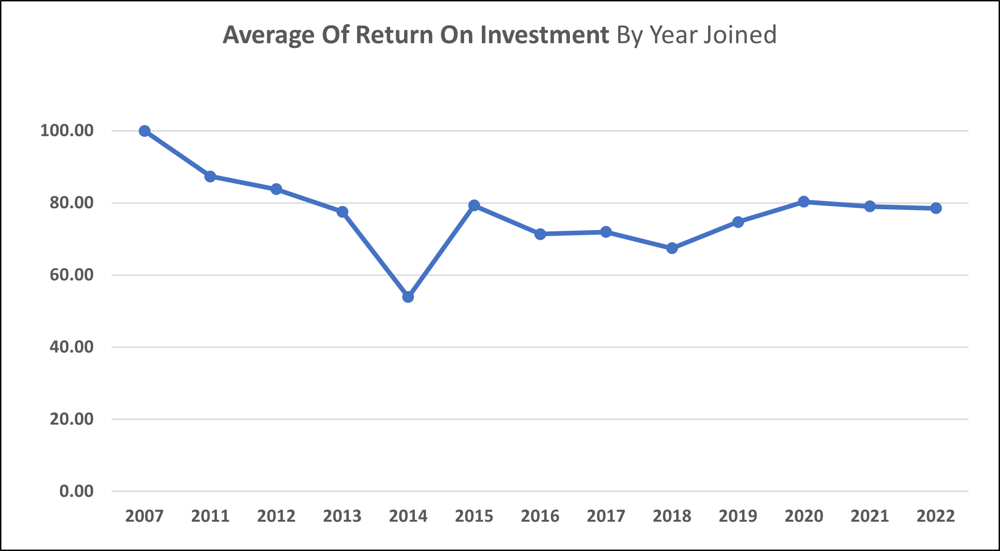
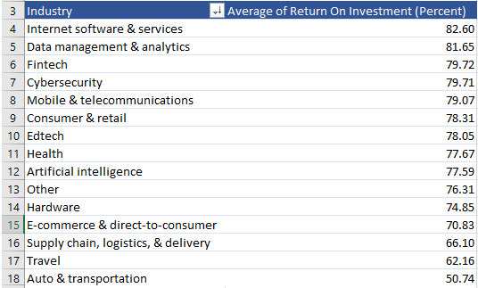
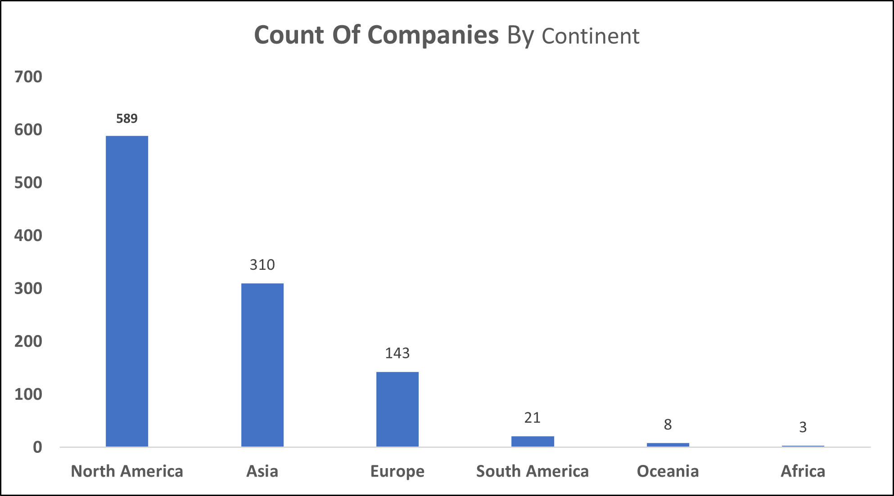

# Unicorn Companies
Analysis to gain performance insights from dataset containing information on 1,074 Unicorn Companies.

---

> [Introduction](https://github.com/Afokoghene/Unicorn-Companies/#introduction)  
> [Problem Statement](https://github.com/Afokoghene/Unicorn-Companies/#problem-statement)  
> [Skills Demonstrated](https://github.com/Afokoghene/Unicorn-Companies/#skills-demonstrated)  
> [Data Sourcing](https://github.com/Afokoghene/Unicorn-Companies/#data-sourcing)  
> [Data Assessment and Transformation](https://github.com/Afokoghene/Unicorn-Companies/#Data-Assessment-,-Cleaning-/-Transformation)  
> [Limitation / Issues](https://github.com/Afokoghene/Unicorn-Companies/#Limitation-/-Issues)  
> [Data Analysis](https://github.com/Afokoghene/Unicorn-Companies/#data-analysis)  
> [Data Visualization](https://github.com/Afokoghene/Unicorn-Companies/#data-visualization)  
> [Insights and Recommendations](https://github.com/Afokoghene/Unicorn-Companies/#Insights-and-Recommendations)  

---

## Introduction
Becoming a Unicorn for a company can be compared to a country winning the FIFA World Cup, or even better, you coming first in a global competition. All the listed scenarios come with joy, as they signify reaching a significant milestone after putting in hard work and being patient enough. As for Unicorn Companies, they are privately held companies that have a current valuation of $1 billion or more.

This dataset contains 1,074 privately held companies that have reached a valuation of $1 billion. The analysis to be carried out aims to gain insights into how these companies have performed during the recorded period and also to identify the year with the highest number of companies becoming unicorns, among other things. 
I will conduct all the analysis processes on MS Excel as I am trying to improve my Excel skills, and this is part of the process.

---

## Problem Statement
The problem statment are the questions that are to be answered from the dataset

1. Which unicorn companies have had the biggest return on investment?
2. How long does it usually take for a company to become a unicorn? Has it always been this way?
3. Which countries have the most unicorns? Are there any cities that appear to be industry hubs?
4. In what year did the most companies become unicorns?
b. What is the average return on investment for companies that join each year? Are there any significant trends or variations over time?
5. Which industry has the highest average Return On Investment (ROI) percentage?
6. Which continent has the highest number of companies in the dataset, and what are the most common industries among them?

---

## Skills Demonstrated
- Cleaning and transformation of data in MS Excel
- Aggregation and Pivot tables in MS Excel
- Visualization of data in MS Excel

---

## Data Sourcing
The dataset was obtained from [Maven Analytics'](https://www.mavenanalytics.io/data-playground?page=3&pageSize=5) website where datasets are generally available for practice purposes.

---

## Data Assessment, Cleaning / Transformation
### Assessment
The dataset was found in a CSV file format and was converted to an Excel workbook to enable editing and save progress.

The dataset originally contained 1,074 rows and 10 columns but during transformation of the dataset, 8 more columns were included to enable easy analysis and agregation.

- The following columns originally came with the dataset
1. Company: The name of the company
2. Valuation: Company valuation in Billions of Dollars but in the format 1B, 2B e.t.c
3. Date Joined: The date in which the company reached $1 billion in valuation
4. Industry: Industry that the company falls under
5. City: City the company was founded in
6. Country: Country the company was founded in
7. Continent: Continent the company was founded in
8. Year Founded: Year the company was founded
9. Funding: Total amount raised across all funding rounds in billions (B) or millions (M) of dollars
10. Select Investors: Top 4 investing firms or individual investors (some have less than 4)

- The following columns were added after transformation:
1. Valuation-C: This column displays the valuation in full figures instead of using $1B or $2B notations.
2. Year Joined: This column indicates the year when each company reached a valuation of $1B. It was derived from the Date Joined column, as the year was necessary for the analysis process.
3. Funding-C: This column shows the total amount raised across all funding rounds in full figures instead of using short forms.
4. Return On Investment (Percent): This column calculates the return on investment for each company based on the Funding and Valuation columns.
5. Diff Between Joined and Founded Year: This column represents the difference between the year each company reached a valuation of $1B and the year they were founded.
6. Select Investor: Four (4) columns were created from this particular column, mainly to hold each investor's information for companies in different cells.

---

### Cleaning / Transformation

1. The dataset was checked for duplicates and none was found.
2. The Substitute function and FlashFill were used to create and fill the Valuation-C column from the Valuation column. This was done to change the format of the column and make it easy for calculations to be done using values from the column.
3. Employed the RIGHT function to get the last 4 digits from the Date Joined to fill the Year Joined column.
4. To obtain the column 'Funding-C,' we first filtered the dataset based on the 'Funding' column to display only rows that ended with 'B' (representing billions). After applying the filtration, we utilized the substitute function twice: once to remove the dollar sign and another time to replace 'B' with '000000000.' This method successfully converted all the rows in billions into the desired format.
5. To acquire the 'Funding-C' column, we initially applied a filter to the dataset, showing only those rows in the 'Funding' column that ended with 'M' (representing millions). Once the filtering was done, we utilized the substitute function twice: the first time to eliminate the dollar sign and the second time to replace 'M' with '000000.' This approach effectively converted all million-based rows into the desired format.
6. This formula **ROI = (Valuation - Funding) / (Valuation) * 100** was used to calculate the Return On Invesment and the result was filled in the 'Return On Investment (Percent)' column.
7. To obtain values for the 'Diff Btw Year Joined and Founded Year' column, simply subtracted the Year Joined from the Year Founded.
8. The Select Investors column had at least 2 investors' names in each cell. So, I separated each investor into different cells, resulting in 4 rows for Select Investors. This was successfully done using the Text To Columns feature in Excel, separating the names based on the comma delimiter.

---

## Limitation / Issues

1. After assessment, it was discovered that the dataset contains companies that became Unicorns in the years 2007 and 2011 to 2022. However, the years 2008, 2009, and 2010 are not included in the dataset. With a little research, I discovered that there were several companies that reached Unicorn status between 2008 and 2010. Unfortunately, these companies were not recorded in the dataset. However, since this is the dataset we have for practice purposes, we will work with it.
2. Furthermore, the analysis revealed that in the year 2007, only one company achieved Unicorn status. The year 2011 had two companies, and 2009 saw the emergence of four Unicorns.

---

## Data Analysis
With the dataset cleaned to satisfaction and transformed into the required formats, we proceeded with the proper analysis process, addressing all the questions arising from the analysis. Each question will be answered with a corresponding visual representation to enhance understanding.

1. Which unicorn companies have had the biggest return on investment?

To calculate the Return On Investment (ROI) for the companies on record, I used the formula below in Excel
ROI = (Valuation - Funding) / (Valuation) * 100
The result was formatted in percentage to see the ROI in percent. 
Twelve (12) companies had their funding recorded as ‘Unknown’ and 1 (one) had its funding as 0M as in ‘0 million’, so they were not taken into account as their ROI comes to be 100% which doesn't correctly represent it.

  

- Above is an Excel table showing the top 10 Unicorn Companies and their Return On Investment (ROI) percentages. From the table, it can be observed that 'Zapier,' with a ROI of 99.98%, an initial funding of $1 Million, and a current valuation of $4 Billion, holds the highest return on investment among the listed companies. Following closely behind Zapier are Dunamu, Workhuman, and CGFI, with respective ROIs of 99.21%, 99.10%, and 99.05%.

This table provides valuable insights into how each company utilizes its resources to generate profits, and this metric, along with other financial indicators, can be used to evaluate the success of a company's investments.

---

2. How long does it usually take for a company to become a unicorn? Has it always been this way?

There is no typical number of years for companies to become Unicorns, as I believe they achieve Unicorn status based on their individual progress and profitability. To get a more accurate answer to this question, I calculated the difference between the year each company became a Unicorn and the year it was founded. After computing the difference for all companies, I then calculated the average duration between their founding year and the year they achieved Unicorn status.

- According to the dataset, it takes companies an average of 7 years to become Unicorns (to reach a valuation of $1 billion).
- I did notice that nine (9) companies became Unicorns in the same year they were founded.
- The company with the highest number of years to become a Unicorn is 'Otto Bock HealthCare.' It became a Unicorn 98 years after its founding. The company was founded in 1919 and achieved Unicorn status in 2017. The dataset shows that the funding for this company is $0 million, with a valuation of $4 billion.

---

3. Which countries have the most unicorns? Are there any cities that appear to be industry hubs?

This question aims to gain geographical insights on the spread of Unicorn Companies among different countries recorded in the dataset. Additionally, it seeks to identify the cities within these countries that hold the most companies.

  

Above is a bar chart showing the top 5 countries with the most Unicorn Companies located in them. From this chart, it can be seen that the United States has the highest number of companies, with a record of 562 Unicorn Companies located in it. Following closely is China with 173 Unicorn Companies. India, the United Kingdom, and Germany have 65, 43, and 26 companies, respectively, which are seen to follow.

3b. Are there any cities that appear to be industry hubs?

  

The visual above shows the top 5 cities with the most Unicorn Companies located in them. This can be used to identify the cities that are hotspots for Unicorn Companies, as a company's location can significantly contribute to its growth and progress. From the chart, it is evident that San Francisco and New York in the United States rank first and second, with 152 and 103 Unicorn Companies located respectively in each city. Beijing, with 63 companies, Shanghai with 44, and London with 34 companies, are ranked third, fourth, and fifth on the list, respectively.

---

4. In what year did the most companies become unicorns?

The question seeks to obtain information about the performance of each year in comparison to others, based on the number of companies that achieved a $1 billion valuation and became Unicorns.

  

The bar chart above shows that the year 2021 had the most companies (520) reaching the 1-billion-dollar valuation and thereby achieving the Unicorn status. This is a significant total compared to the number of companies that reached this status in the following year, 2022, which, according to the dataset, had 116 companies. In 2020, the year next in rank, there were a total of 108 companies that became unicorns.

4b. What is the average return on investment for companies that join each year? Are there any significant trends or variations over time?

Each year's success is compared to the others in this question as we take into account the average return on investment of all companies that became unicorns in each year. We then compare it to the average return on investment of the others to see which had the highest average return on investment.

  

- The year 2007 is seen to have the highest average return on investment of 100.00%. However, as stated in the 'Limitations / Issues' section of this document, 2007 had just one company recorded to have become a Unicorn, and the funding of that company was recorded as 'Unknown.' This is the reason it has an average ROI of 100.00%.
- In 2011, we observe the second-highest average ROI of 87.32%. This figure drops in the following year, 2012, with an average ROI of 83.82%.
- On the other hand, 2014 has the lowest average ROI of 52.92%. This is a direct result of two companies having negative ROIs. One company with an initial funding of $2 billion only reached the Unicorn Status with a valuation of $1 billion in 2014, leading to an ROI of -100.00%. Another company, with an initial funding of $3 billion, only reached the Unicorn Status with a valuation of $2 billion, resulting in an ROI of -50%.

---
5. Which industry has the highest average Return On Investment (ROI) percentage?

The question here aims to grade industries based on the average Return On Investment (ROI) obtained from the ROI of companies in each of those industries. This will assist a future investor in deciding which industry he/she would like to invest in, ensuring profitability and good returns based on this data.

  

Judging from the results displayed in the table above, a future investor would likely choose to invest in the Internet Software and Services industry, as it boasts the highest average ROI of 82.60%. Following closely behind are the Data Management and Analytics industry, with an average ROI of 81.65%, FinTech with 79.72%, and the Cybersecurity industry with an average ROI of 79.71%.

---

6. Which continent has the highest number of companies in the dataset, and what are the most common industries among them?

This aims to determine which continent has the most companies located within it. Such information can be used to assess which continent provides a better breeding ground for companies and also to identify continents that need more attention in terms of establishing companies, as markets may be less competitive in continents with lower amounts of Unicorn Companies.

  

The answer to this question is displayed in the bar chart above, showing that North America is the continent with the most companies located in it, with a total count of 589 companies. Asia, the continent with the second most Unicorn Companies, has a total of 310 companies. Africa is seen to be the continent with the least number of Unicorn Companies, as it has just three of those.
- Asia comes in second place with 54 companies in the E-commerce & direct-to-consumer industry and 38 companies in the Fintech industry.
- Interestingly, the Fintech industry is the most widespread among continents, with a presence in all continents and at least 2 companies in each.
- The Mobile and Telecommunications industry is the second most common across continents, with at least 1 company present in each continent except for Oceania.

- It would have made much more sense to compare countries and continents by their average ROI to determine the most successful ones based on the ROI from companies located in each region. However, in m opinion this approach might not be ideal, as countries like Bermuda, with only one company, would top the chart. On the other hand, countries like the USA and China, with the most companies, would be somewhere in the middle. Thus, I do not believe this method would provide a fair representation.

---

## Data Visualization
This the visual representation for this project was built using MS Excel and each was built to match each question to be answered and for that reason there is no dashbpard for this. Please refer to the Data Analysis section to view visuals created.

---

## Insights and Recommendations

1. Based on the dataset, Zapier stands out as the most profitable company, achieving a remarkable Return On Investment of 99.98%. With an initial funding of $1 Million, it grew to a valuation of $4 Billion within 10 years of its founding. Potential investors should consider Zapier when looking for profitable investment opportunities. Dunamu comes in as the second most profitable company in the dataset, securing an initial funding of $71 Million and currently valued at $9 Billion, with a Return on Investment of 99.21% since its founding. Workhuman and CGFI closely follow with respective ROIs of 99.10% and 99.05%.

2. In the dataset, the USA leads with 562 companies that have achieved Unicorn status. This indicates that the USA is a favorable environment for startups to flourish. Founders may consider launching their companies in the USA, given the significant number of Unicorn companies compared to other countries in the dataset. China follows as the second country with the most Unicorn companies, totaling 173. India, the United Kingdom, and Germany trail behind with 65, 43, and 26 Unicorn companies, respectively.

3. As previously observed, the USA leads in the number of companies achieving Unicorn status. Among the cities in the USA, San Francisco and New York stand out with 152 and 103 unicorn companies, respectively, making them the top two cities in this regard. This reaffirms the USA's position as a favorable environment for startup growth. In China, Beijing, the capital city and the second country with the most unicorn companies, boasts 63 such companies, establishing itself as a significant player in the startup landscape. Following closely are Shanghai and London with 44 and 34 companies, respectively.

4. Based on the dataset, it is observed that in 2021, the highest number of companies (520) became Unicorns. However, in 2022, only 116 companies achieved Unicorn status. This discrepancy might be due to incomplete information for the year 2022, as the dataset was collected before the year's end. In 2020 and 2019, there were 108 and 104 companies, respectively, which became Unicorns.
- In 2011, we see that the average return on investment (ROI) was the second-highest at 87.32%. The following year, 2012, the average ROI dropped to 83.82%. On the other hand, in 2014, we observed the lowest average ROI of 52.92%. This was because two companies had negative ROIs. One of these companies started with $2 billion in funding but only reached a valuation of $1 billion when it became a Unicorn in 2014, resulting in an ROI of -100.00%. The other company started with $3 billion in funding and reached a Unicorn status with a valuation of $2 billion, leading to an ROI of -50%.

5. The Internet Software and Services industry has the highest average ROI among companies, at 82.60% based on the recorded dataset. This suggests that companies in this sector experienced the most returns. Future investors may find it advisable to consider investing in companies within this industry. Following closely is the Data Management and Analytics industry, which boasts an average ROI of 81.65%, making it another attractive option for investors. Fintech and Cybersecurity have similar average ROIs of 79.72% and 79.71% respectively, making them promising choices as well.

6. North America has 589 companies, making it the continent with the highest number of companies achieving the Unicorn Status. Out of these 589 companies, 562 are located in the USA. However, it cannot be asserted that the entire continent is a favorable breeding ground for startups, as the companies are concentrated in the USA, which is widely recognized as the primary hub for startups in the region.

Asia follows closely with 310 companies reaching the Unicorn status, making it the continent with the second-highest number of such companies. On the other hand, Africa has only 3 companies that have reached the Unicorn status, making it the continent with the fewest companies achieving this milestone.

---

Thank you for reading up until this spot. I do need a job (paid or unpaid internships to gain more experience, full time jobs where I can of course learn on the job too). Send me an email on afokeosiobe@gmail.com or connect with me on [Twitter](https://twitter.com/__afoke?t=_YX2DAel3R3aWZGDvSEZ9w&s=09), and [LinkedIn](https://www.linkedin.com/in/afokoghene-osiobe-arierhi-9b235b25b).

